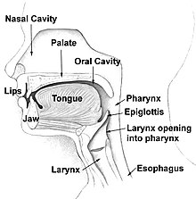

# Articulation

Articulation refers to the physical movement of speech organs (e.g., tongue, lips, palate) to produce speech sounds.

## Speech Organs

The primary organs involved in articulation include the tongue, lips, teeth, alveolar ridge, hard palate, soft palate (or velum), and the glottis.

## Places of Articulation

- **Bilabial** sounds are created using both lips (e.g., /p/, /b/).
- **Labiodental** sounds involve the lower lip and the upper teeth (e.g., /f/, /v/)
- **Dental** use the tongue and teeth (e.g., /θ/ as in "think").
- **Alveolar** are formed with the tongue touching or approaching the alveolar ridge (e.g., /t/, /d/, /s/, /z/).
- **Palatal** occur when the tongue contacts the hard palate (e.g., /ʃ/ as in "she").
- **Velar** sounds are made with the tongue near the soft palate (e.g., /k/, /g/).
- **Glottal** sounds are produced in the glottis (e.g., /h/).

## Manners of Articulation

The way sounds are articulated varies by how air is manipulated:

- In stops (plosives), the vocal tract is fully closed and then released (e.g., /p/, /t/, /k/).
- Fricatives are formed by a narrow constriction that creates friction (e.g., /f/, /s/, /ʃ/).
- Affricates begin with a stop and release into a fricative (e.g., /tʃ/ as in "church").
- Nasals involve air passing through the nose (e.g., /m/, /n/).
- Liquids allow air to flow around the tongue with some closure (e.g., /l/, /r/).
- Glides (approximants) involve slight constriction (e.g., /w/, /j/).

## Related Topics

- [Vowel](Vowel.md)
- [Consonant](Consonant.md)
- [Coarticulation](Coarticulation.md)

## External Links

- [Articulatory Phonetics - Wikipedia](https://en.wikipedia.org/wiki/Articulatory_phonetics)
- [The Vocal Tract - University of Iowa](https://soundsofspeech.uiowa.edu/)

## References

- Ladefoged, P., & Johnson, K. (2014). *A Course in Phonetics*. Cengage Learning.

---

[Back to Phonetics](README.md)
