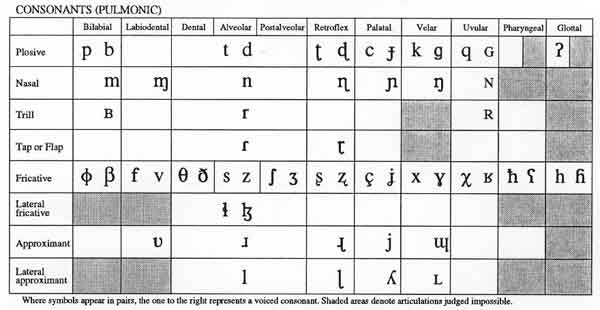

# Consonant

A consonant is a speech sound produced with some constriction or closure in the vocal tract, impeding the airflow.

## Consonant Chart (IPA)

## Classification

Consonants can be categorized by:

- **Place of Articulation**, indicating where in the vocal tract the constriction happens.
- **Manner of Articulation**, describing how the airflow is controlled or blocked.
- **Voicing**, which identifies if the vocal cords vibrate during the sound's production.

## Examples in English

Some common examples include:

- Bilabial stops like /p/ (voiceless) and /b/ (voiced).
- Alveolar fricatives such as /s/ (voiceless) and /z/ (voiced).
- The velar nasal /ŋ/, heard in words like "sing."

## Related Topics

- [Vowel](../Core.Vowel.md)
- [Articulation](Articulation.md)

## External Links

- [Consonant - Wikipedia](https://en.wikipedia.org/wiki/Consonant)
- [Interactive IPA Chart - International Phonetic Association](https://www.internationalphoneticassociation.org/content/ipa-chart)

## References

- Ladefoged, P., & Johnson, K. (2014). *A Course in Phonetics*. Cengage Learning.

---

[Back to Phonetics](../README.md)
