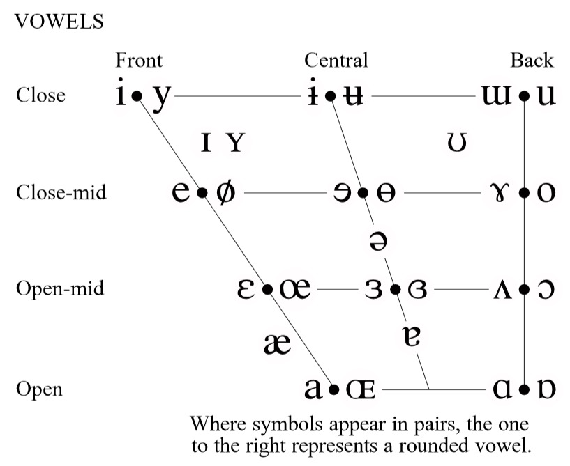

# Vowel

A vowel is a speech sound produced without significant constriction or closure in the vocal tract, allowing air to flow freely.

## Vowel Chart (IPA)

## Classification

Vowels are classified based on:

- **Height of the Tongue**, which determines whether the vowel is high (close), mid, or low (open).
- **Position of the Tongue**, which specifies if the vowel is front, central, or back.
- **Lip Rounding**, which describes whether the lips are rounded or unrounded.

## Examples in English

Some common examples of English vowels include:

- High front vowel: /iː/ as in "see"
- Mid central vowel: /ə/ (schwa) as in "sofa"
- Low back vowel: /ɑː/ as in "father"

## Related Topics

- [Consonant](Consonant.md)
- [International Phonetic Alphabet (IPA)](International-Phonetic-Alphabet.md)
- [Articulation](Articulation.md)

## External Links

- [Vowel - Wikipedia](https://en.wikipedia.org/wiki/Vowel)
- [Interactive IPA Chart - International Phonetic Association](https://www.internationalphoneticassociation.org/content/ipa-chart)

## Sources

- Ladefoged, P., & Johnson, K. (2014). *A Course in Phonetics*. Cengage Learning.

---

[Back to Phonetics](../README.md)
