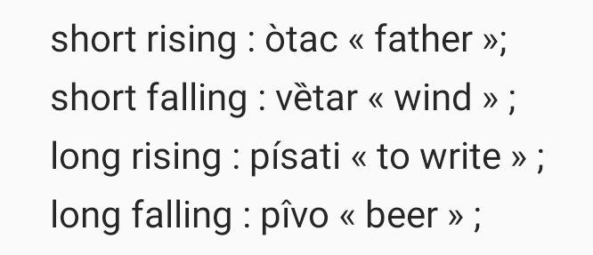

# Tone

Tone involves using pitch to convey different meanings or grammatical nuances in spoken language.

## Types of Tone Languages

- Level tone languages use steady pitches without significant change.
- Contour tone languages incorporate pitch movements, such as rising and falling tones.

## Examples

- In Mandarin Chinese, the syllable **"ma"** can have various meanings based on the tone:
  - High level tone: "mother"
  - Rising tone: "hemp"
  - Falling-rising tone: "horse"
  - Falling tone: "scold"
- Serbian uses pitch accent system:  

## Related Topics

- [Prosody](Prosody.md)
- [Intonation](Intonation.md)

## External Links

- [Tone (Linguistics) - Wikipedia](https://en.wikipedia.org/wiki/Tone_(linguistics))
- [Tone - SIL International](https://glossary.sil.org/term/tone)

## Sources

Yip, M. (2002). *Tone*. Cambridge University Press.

---

[Back to Phonetics](../README.md)
