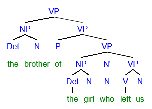

# Syntactic Tree

A syntactic tree, or parse tree, is a diagram representing the hierarchical structure of a sentence, showing the relationships between constituents.

## Components

- **Nodes** represent constituents (e.g., NP, VP).
- **Branches** connect nodes to show relationships.
- **Root Node** represents the entire sentence (S).

## Example

## External Links

- [Parse Tree - Wikipedia](https://en.wikipedia.org/wiki/Parse_tree)
- [Tree Diagrams - SIL International](https://glossary.sil.org/term/tree-diagram)
- [Syntatic Tree Tutorial](https://www.youtube.com/watch?app=desktop&v=CeuhQ3s-Jss)

## Sources

- Carnie, A. (2013). *Syntax: A Generative Introduction*. Wiley-Blackwell.

---

[Back to Syntax](../README.md)
