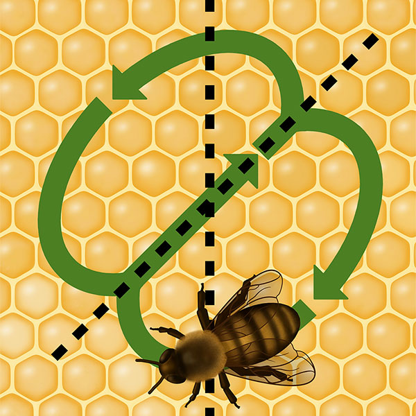

# Signal Systems

Communication systems used by animals, which lack the complexity and generative grammar of human language.

## Characteristics

- Finite number of messages.
- Cannot create new meanings by combining signals.
- Signals often tied to immediate context.

## Examples

- **Bee Waggle Dance**:
  - Bees communicate the location of food sources through specific movements.

- **Bird Songs**:
  - Used for mating calls or territorial signals.

## Key Differences from Human Language

- Human language can produce infinite messages; animal signals cannot.
- Human language can refer to past and future events; animal signals are typically about the present.

## Sources

- Yule, G. (2016). *The Study of Language*. Cambridge University Press.

## Additional Resources

- [Animal Communication - Wikipedia](https://en.wikipedia.org/wiki/Animal_communication)
- [Bee Waggle Dance - National Geographic](https://www.nationalgeographic.com/animals/article/honeybee-waggle-dance-explained)

---

[Back to Language](README.md)
