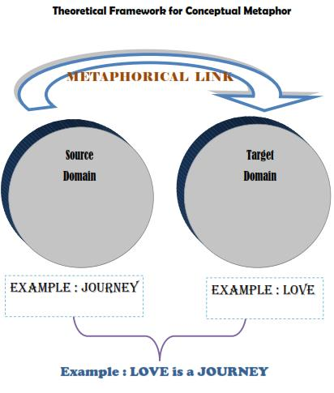

# Conceptual Metaphor Theory

Conceptual Metaphor Theory (CMT) posits that metaphors are not just linguistic expressions but fundamental cognitive mechanisms that shape our understanding of abstract concepts through more concrete experiences.

> **Lakoff and Johnson (1980):**
> "Our ordinary conceptual system, in terms of which we both think and act, is fundamentally metaphorical in nature."

## Essentials

- **Conceptual Metaphor** is understanding one domain in terms of another.
- **Metaphorical Mapping** is a systematic correspondences between source and target domains.
- **Embodied Metaphor** is grounding metaphors in physical experiences.

## Common Conceptual Metaphors

- **Time is Money**: "You're wasting my time."
- **Love is a Journey**: "Our relationship has hit a dead end."
- **Ideas are Food**: "I can't digest all these facts."

## Related Topics

- [Cognitive Semantics](Cognitive-Semantics.md)
- [Embodiment in Language](Embodiment-in-Language.md)
- [Mental Spaces Theory](Mental-Spaces-Theory.md)

## External Links

- [Conceptual Metaphor - Wikipedia](https://en.wikipedia.org/wiki/Conceptual_metaphor)
- [Metaphor Map of English](http://metaphormap.ihmc.us/)

## Sources

- Lakoff, G., & Johnson, M. (1980). *Metaphors We Live By*. University of Chicago Press.
- Kövecses, Z. (2010). *Metaphor: A Practical Introduction*. Oxford University Press.
- Evans, V., & Green, M. (2006). *Cognitive Linguistics: An Introduction*. Lawrence Erlbaum Associates.

---

[Back to Cognitive Linguistics](../README.md)
