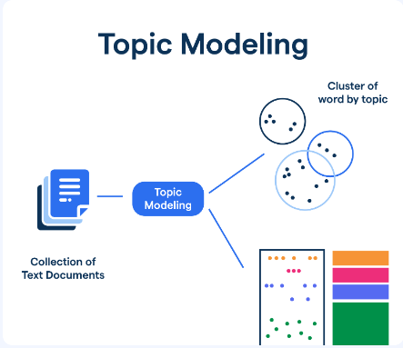

# Topic Modeling

Topic modeling is a technique in natural language processing that uncovers hidden themes within large sets of text. By recognizing recurring words and patterns, it helps identify the main topics in a corpus, making it easier to understand and summarize extensive datasets.

## Purpose

- Identifies themes that represent the core ideas in documents.
- Reduces the complexity of large collections by condensing them into a smaller set of topics.
- Clusters documents based on shared topics, aiding in organization and categorization.

How Topic Modeling works. High-level representation:  

## Common Techniques

- Latent Dirichlet Allocation (LDA) is a probabilistic approach that treats documents as a combination of topics and topics as a mix of words.
- Non-Negative Matrix Factorization (NMF) uses linear algebra to break down document-term matrices into topics and their word distributions.
- Latent Semantic Analysis (LSA) applies singular value decomposition (SVD) to term-document matrices, uncovering patterns that represent topics.

## Additional Resources

- [Topic Modeling - Wikipedia](https://en.wikipedia.org/wiki/Topic_model)
- [Gensim Topic Modeling](https://radimrehurek.com/gensim/)
- [LDA in Scikit-Learn](https://scikit-learn.org/stable/modules/generated/sklearn.decomposition.LatentDirichletAllocation.html)

## Sources

- Blei, D. M., Ng, A. Y., & Jordan, M. I. (2003). *Latent Dirichlet Allocation*. Journal of Machine Learning Research.
- Manning, C. D., & Schütze, H. (1999). *Foundations of Statistical Natural Language Processing*. MIT Press.

---

[Back to Computational Linguistics](../README.md)
