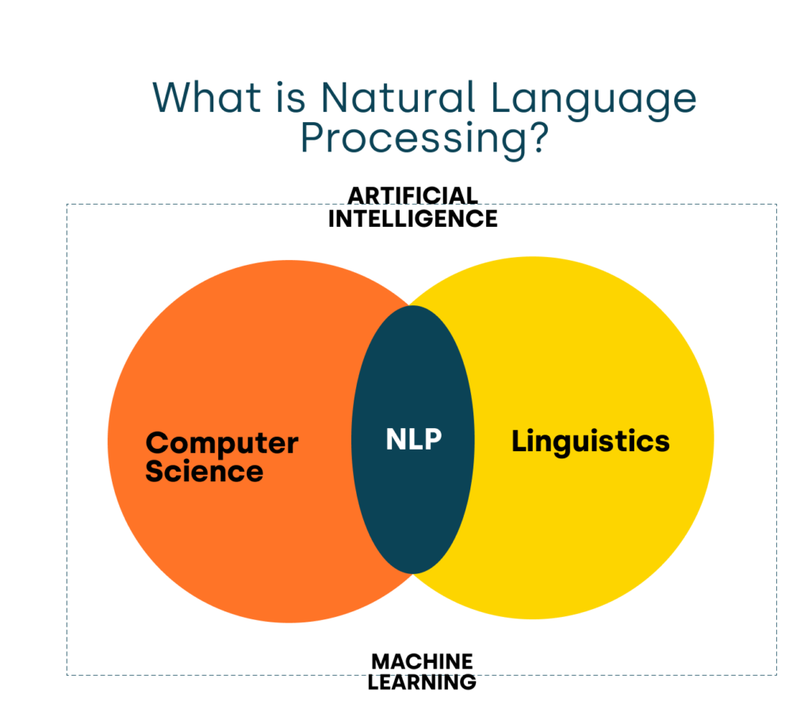

# Natural Language Processing (NLP)

Natural Language Processing is a subfield of artificial intelligence focused on enabling computers to understand, interpret, and generate human language.

## Main Areas of NLP

- Text processing involves tasks like tokenization, stemming, and lemmatization.
- Syntactic analysis deals with parsing sentences to grasp their grammatical structure.
- Semantic analysis is about understanding meaning and context within text.
- Pragmatics covers understanding language in real-world context, including idioms and metaphors.

## Common Techniques

- Rule-based approaches rely on handcrafted linguistic rules to process language.
- Statistical methods use probabilistic models to make predictions about language.
- Machine learning approaches train models on large datasets to detect and learn language patterns.

## Related Topics

- [N-gram Models](../Language-Models/N-gram-Models.md)
- [Probabilistic Models](../Language-Models/Probabilistic-Models.md)

## Additional Resources

- [Natural Language Processing - Wikipedia](https://en.wikipedia.org/wiki/Natural_language_processing)
- [Stanford NLP Group](https://nlp.stanford.edu/)

## Sources

- Jurafsky, D., & Martin, J. H. (2020). *Speech and Language Processing*. Prentice Hall.
- Bird, S., Klein, E., & Loper, E. (2009). *Natural Language Processing with Python*. O'Reilly Media.

---

[Back to Computational Linguistics](../README.md)
