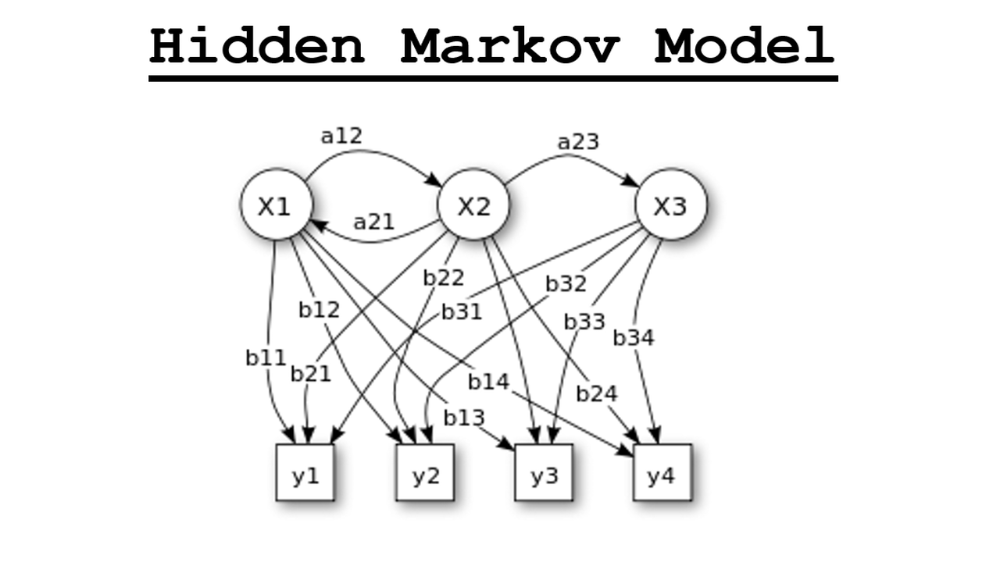

# Hidden Markov Models (HMMs)

Hidden Markov Models are statistical models that describe systems with hidden states that cannot be directly observed. They are commonly used in fields like computational linguistics, speech recognition, and bioinformatics to model sequences of events influenced by underlying hidden processes.

## Main Components of an HMM

An HMM consists of several core elements:
1. States represent the hidden parts of the process.
2. Observations are the events or data points that can be seen and are generated by the hidden states.
3. Transition probabilities define the likelihood of moving from one state to another.
4. Emission probabilities indicate the chances of each observable outcome for a given hidden state.
5. Initial probabilities show the distribution for starting in any of the states.

## Algorithms of HMMs

HMMs are supported by key algorithms:
- The forward algorithm calculates the probability of an observed sequence.
- The Viterbi algorithm identifies the most likely sequence of hidden states given an observed sequence. It is commonly used for tasks such as speech recognition and part-of-speech tagging.
- The Baum-Welch algorithm, an expectation-maximization method, estimates HMM parameters, especially in unsupervised learning scenarios.

## Additional Resources

- [Hidden Markov Model on Wikipedia](https://en.wikipedia.org/wiki/Hidden_Markov_model)
- [HMM in Speech Recognition](https://cmusphinx.github.io/wiki/tutorialhmm/)
- [HMMs in Python (hmmlearn)](https://hmmlearn.readthedocs.io/)

## Sources

- Rabiner, L. R. (1989). *A Tutorial on Hidden Markov Models and Selected Applications in Speech Recognition*. Proceedings of the IEEE.
- Jurafsky, D., & Martin, J. H. (2009). *Speech and Language Processing*. Pearson.

---

[Back to Topics](README.md)
