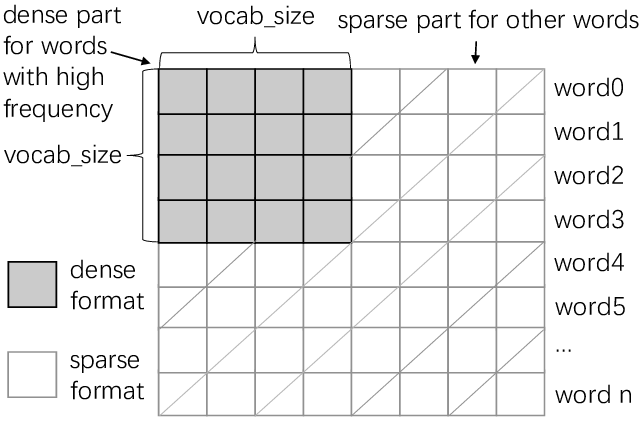

# GloVe

GloVe, or Global Vectors for Word Representation, is an unsupervised algorithm designed to create word embeddings by using global word-word co-occurrence statistics from a corpus.

Co-occurence matrix in GloVe:  

## Objective

GloVe combines the strengths of count-based and predictive methods, making it a powerful tool for generating word vectors. It builds a word co-occurrence matrix where each entry shows how often one word appears near another. The algorithm aims to minimize the difference between the dot product of word vectors and the logarithm of the probability of their co-occurrence.

## Advantages

GloVe captures semantic relationships in a way that highlights linear substructures, similar to Word2Vec. It is known for its strong performance across various tasks and can train efficiently even on large corpora.

## Related Topics

- [Word Embeddings](Word-Embeddings.md)
- [Word2Vec](Word2Vec.md)

## Additional Resources

- [GloVe Project Page](https://nlp.stanford.edu/projects/glove/)
- [GloVe Explained](https://medium.com/@sonicboom8/glove-global-vectors-for-word-representation-5a262012210d)

## Sources

- Pennington, J., Socher, R., & Manning, C. D. (2014). "GloVe: Global Vectors for Word Representation." *Proceedings of the 2014 Conference on Empirical Methods in Natural Language Processing*, 1532–1543.

---

[Back to Computational Linguistics](../README.md)
