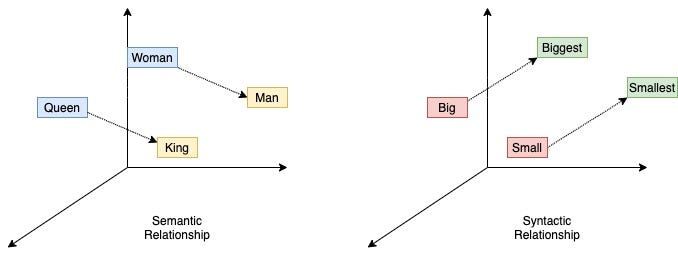

# Word2Vec

Word2Vec is a set of models used to create word embeddings through shallow neural networks. It was developed by Tomas Mikolov and his team at Google in 2013 and includes two main architectures: Continuous Bag-of-Words (CBOW) and Skip-Gram.

## Architectures

### Continuous Bag-of-Words (CBOW)

The CBOW model aims to predict a target word based on its surrounding context words. It takes context words as input and outputs the target word. This model trains quickly and is particularly effective for predicting frequent words.

### Skip-Gram

The Skip-Gram model, on the other hand, predicts surrounding context words given a target word. It uses the target word as input and generates context words as output. Skip-Gram is better suited for learning from less frequent words and capturing more detailed relationships.

## Main Features

Word2Vec stands out due to its efficiency, as it can be trained on large datasets relatively quickly. The embeddings it produces capture semantic relationships, revealing linear connections between words, such as "king" minus "man" plus "woman" approximately equaling "queen." Typically, Word2Vec embeddings use between 100 and 300 dimensions.

The Illustration of Word2Vec Embeddings:  

## Additional Resources

- [Word2Vec Explained](https://towardsdatascience.com/word2vec-explained-49c52b4ccb71) (Towards Data Science)
- [Gensim Word2Vec Tutorial](https://radimrehurek.com/gensim/models/word2vec.html)

## Sources

- Mikolov, T., Chen, K., Corrado, G., & Dean, J. (2013). "Efficient Estimation of Word Representations in Vector Space." *arXiv preprint arXiv:1301.3781*.
- Mikolov, T., Sutskever, I., Chen, K., Corrado, G. S., & Dean, J. (2013). "Distributed Representations of Words and Phrases and their Compositionality." *Advances in Neural Information Processing Systems*, 26, 3111–3119.

---

[Back to Computational Linguistics](../README.md)
