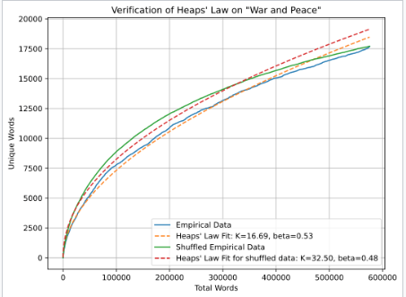

# Heaps' Law

Heaps' Law helps explain how a text's vocabulary grows as more words are added. While the total number of words increases, the pace at which new, unique words appear slows down over time.

The Heaps' Law:     

## The Formula

The relationship is shown by:

**V(N) = K * N^β**

Where:
- **V(N)** represents the number of unique words,
- **N** is the total word count,
- **K** is a constant affected by language and corpus type,
- **β** typically ranges from 0.4 to 0.6.

## Insights

- New words continue to emerge as text grows, but not as quickly as at the start.
- This suggests that language has the potential to keep generating words.
- Useful for researchers who need to know how large their text samples should be for meaningful analysis.

## Heaps' Law vs. Zipf's Law

While Zipf’s Law explains word frequency patterns within a text, Heaps' Law looks at how the number of unique words expands as the total text size grows.

## Additional Resources

- [Heaps' Law on Wikipedia](https://en.wikipedia.org/wiki/Heaps%27_law)
- [Stanford NLP Guide](https://nlp.stanford.edu/IR-book/html/htmledition/heaps-law-1.html)

## Sources

- Heaps, H. S. (1978). *Information Retrieval: Computational and Theoretical Aspects*. Academic Press.
- Baayen, R. H. (2001). *Word Frequency Distributions*. Kluwer Academic Publishers.

---

[Back to Corpus Linguistics](README.md)
