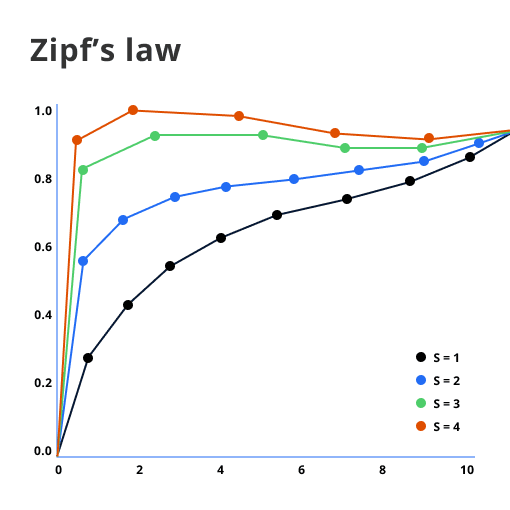

# Zipf's Law

Zipf's Law describes how words are distributed by frequency in a language. It shows that the most frequent word appears far more often than others, with frequency dropping as rank increases.

## The Formula

The basic idea can be summarized as:

- **Frequency ∝ 1 / Rank**

## What This Means

- A small number of words appear very often in any given text.
- There are many words that show up only once or very infrequently.
- This insight can be helpful in understanding which words are crucial to learn for language acquisition.

## Real-Life Examples

The most common word in English, like "the," might appear thousands of times in a large text, while less common words might be used only once or twice.

## Additional Reading

- [Zipf's Law on Wikipedia](https://en.wikipedia.org/wiki/Zipf's_law)

## Reference

- Zipf, G. K. (1949). *Human Behavior and the Principle of Least Effort*. Addison-Wesley.

---

[Back to Corpus Linguistics](README.md)
