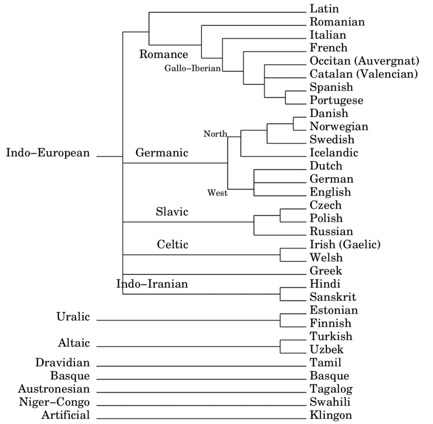

# Language Families

Language families consist of groups of languages that have evolved from a shared ancestral language, known as a proto-language. Studying these families allows linguists to trace the history and relationships between languages.

## Major Language Families

Some of the major language families include:

- **Indo-European**, which covers languages like English, Spanish, Hindi, and Russian.
- **Sino-Tibetan**, encompassing languages such as Mandarin Chinese, Burmese, and Tibetan.
- **Afro-Asiatic**, including Arabic, Hebrew, and Amharic.
- **Niger-Congo**, with languages like Swahili, Yoruba, and Zulu.
- **Austronesian**, covering Malay, Tagalog, and Maori.

Indo-European family:  

## Classification Criteria

Languages within a family share genetic relationships inferred through systematic similarities. Cognates, which are words with a common origin across languages, help establish these relationships. Regular sound correspondences, where phonetic similarities appear consistently across related languages, also play a crucial role in classification.

## Methods

Linguists use several methods to study language families. The comparative method involves comparing languages to identify genetic ties. Lexicostatistics measures how much languages have diverged based on core vocabulary. Phylogenetic analysis uses computational models to infer relationships and construct language trees.

## Methods

- **Comparative Method**: Comparing languages to establish genetic relationships.
- **Lexicostatistics**: Measuring linguistic divergence based on core vocabulary.
- **Phylogenetic Analysis**: Using computational models to infer language trees.

## Related Topics

- [Comparative Method](Comparative-Method.md)
- [Sound Change](Sound-Change.md)
- [Language Classification](Language-Classification.md)

## External Links

- [Language Family - Wikipedia](https://en.wikipedia.org/wiki/Language_family)
- [Ethnologue Language Families](https://www.ethnologue.com/browse/families)

## Sources

- Ruhlen, M. (1991). *A Guide to the World's Languages*. Stanford University Press.
- Comrie, B. (Ed.). (1987). *The World's Major Languages*. Oxford University Press.

---

[Back to Historical-Comparative Linguistics](../README.md)
