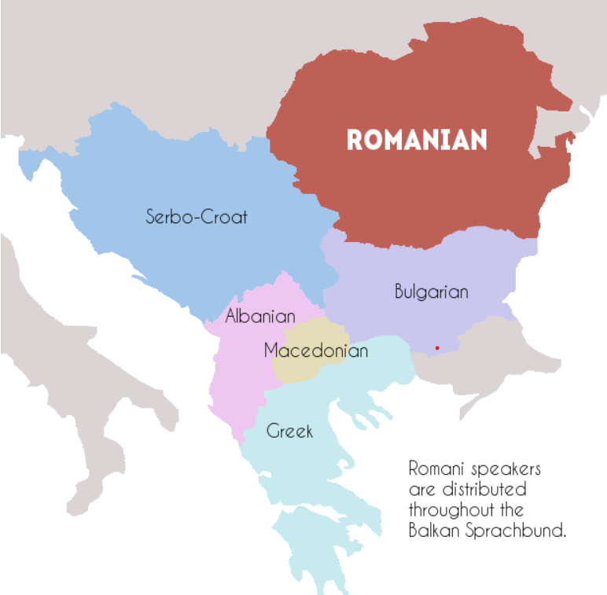

# Areal Linguistics

Areal linguistics studies the features shared by languages within a geographical area, emphasizing the influence of language contact over genetic relationships.

## Essentials

Areal linguistics focuses on concepts such as the Sprachbund, which is a linguistic area where languages share features due to contact. Convergence refers to languages becoming more similar over time through sustained interaction, while diffusion of features is the spread of phonological, grammatical, or lexical traits across languages.

## Famous Sprachbunds

- **Balkan Sprachbund**: Encompasses languages such as Albanian, Macedonian, and Greek that share grammatical features due to extensive contact.

 

- **South Asian Linguistic Area**: Includes languages like Hindi, Bengali, and Dravidian languages.
- **Mesoamerican Linguistic Area**: Features languages such as Nahuatl and Mayan, which share typological traits.

## Features Studied

Areal linguistics looks at phonological features like tonal systems, morphological aspects such as case systems, syntactic patterns including word order, and lexical borrowing.

## External Links

- [Areal Linguistics - Wikipedia](https://en.wikipedia.org/wiki/Areal_linguistics)
- [Sprachbund Studies](https://glottopedia.org/wiki/Sprachbund)

## Sources

Campbell, L. (2006). "Areal Linguistics: A Closer Scrutiny." In *Linguistic Areas*, 1–31.  
Thomason, S. G. (2001). *Language Contact: An Introduction*. Edinburgh University Press.

---

[Back to Historical-Comparative Linguistics](../README.md)
