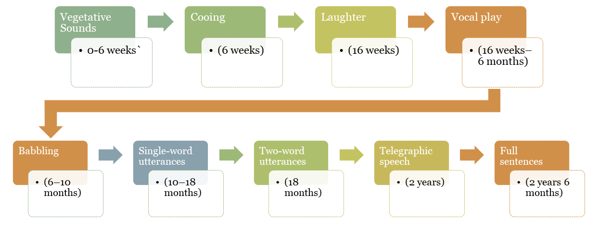

# Language Acquisition

Language acquisition is the study of how humans develop the ability to perceive, produce, and use language for communication. This field covers first language acquisition in children and second language acquisition in adults.

## First Language Acquisition

### Stages of Development

Children go through several stages as they acquire their first language:

1. **Babbling Stage**: Infants begin producing a variety of sounds, usually between 6 to 8 months.
2. **One-Word Stage**: Single words are used to express complete ideas, around 9 to 18 months.
3. **Two-Word Stage**: Simple word combinations start forming between 18 to 24 months.
4. **Telegraphic Speech**: Short, straightforward sentences appear from 24 to 30 months.
5. **Complex Sentences**: By 30 months and beyond, grammar and more intricate sentence structures develop.

### Theories

Several theories explain how language is acquired:

- **Behaviorist Theory** sees language learning as a process of imitation and reinforcement, as proposed by Skinner.
- **Nativist Theory** suggests that humans have an inborn language faculty, a concept developed by Chomsky through the idea of Universal Grammar.
- **Social Interactionist Theory** highlights the importance of social interaction in language development, as argued by Vygotsky.

## Related Topics

- [Bilingualism](Bilingualism.md)
- [Language Disorders](Language-Disorders.md)

## External Links

- [Language Acquisition - Wikipedia](https://en.wikipedia.org/wiki/Language_acquisition)
- [First Language Acquisition Theories](https://www.simplypsychology.org/language.html)

## Sources

- Chomsky, N. (1965). *Aspects of the Theory of Syntax*. MIT Press.  
- Vygotsky, L. S. (1978). *Mind in Society: The Development of Higher Psychological Processes*. Harvard University Press.  
- Lightbown, P. M., & Spada, N. (2013). *How Languages are Learned*. Oxford University Press.
- Pinker, S. (1994). *The Language Instinct*. William Morrow and Company.

---

[Back to Psycholinguistics](README.md)
