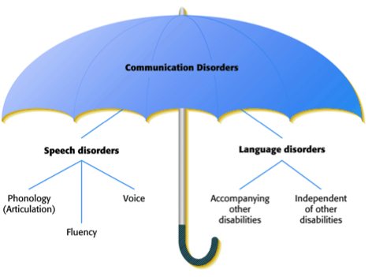

# Language Disorders

Language disorders, also known as language impairments, affect an individual's ability to acquire, produce, or comprehend language. Studying these disorders helps psycholinguists understand language processing and develop effective interventions.

Language and Speech disorders are communication disorders:

## Types of Language Disorders

### Aphasia

Aphasia is a condition where language abilities are lost or impaired due to brain damage. Different types of aphasia include:

- **Broca's Aphasia** involves difficulty with speech production while comprehension often remains intact.
- **Wernicke's Aphasia** results in fluent but nonsensical speech and impaired comprehension.
- **Global Aphasia** is a severe form affecting both language production and comprehension.

### Specific Language Impairment (SLI)

SLI refers to delayed or disordered language development without an apparent cause. People with SLI often struggle with grammar, vocabulary, and coherent discourse.

### Dyslexia

Dyslexia is a learning disorder that primarily affects reading and spelling. It is often associated with difficulties in phonological processing and word decoding.

### Autism Spectrum Disorder (ASD)

Individuals with ASD may experience language issues, including challenges with pragmatics, understanding non-literal language, and social communication.

## Related Topics

Explore these topics for more insights:

- [Neurolinguistics](Advanced/Neurolinguistics.md)
- [Speech Production](Speech-Production.md)
- [Language Acquisition](Language-Acquisition.md)

## External Links

- [Language Disorder - Wikipedia](https://en.wikipedia.org/wiki/Language_disorder)
- [American Speech-Language-Hearing Association](https://www.asha.org/)

## Sources

Bishop, D. V. M. (1997). *Uncommon Understanding: Development and Disorders of Language Comprehension in Children*. Psychology Press.  
Goodglass, H., & Wingfield, A. (1997). *Anomia: Neuroanatomical and Cognitive Correlates*. Academic Press.

---

[Back to Psycholinguistics](README.md)
