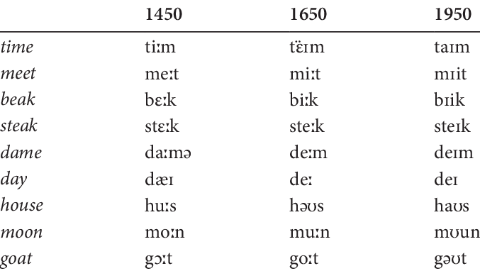

# Language Change

Language change is the evolution of language forms and structures over time, influenced by social, cultural, and cognitive factors.

## Types of Language Change

- **Phonological Change** (e.g., Great Vowel Shift).
- **Morphological Change**
- **Syntactic Change**
- **Semantic Change**
- **Lexical Change**

### Great Vowel Shift: 

## Examples

For example, in old english sound "a" was pronounced flat: the word "make" would be pronounced as "ma:k"

## Related Topics

- [Language Variation](Language-Variation.md)

## Additional Resources

- [Language Change - Wikipedia](https://en.wikipedia.org/wiki/Language_change)
- [Historical Linguistics - SIL International](https://glossary.sil.org/subject/historical-linguistics)

## Sources

- Trask, R. L. (1996). *Historical Linguistics*. Arnold.

---

[Back to Sociolinguistics](../README.md)
